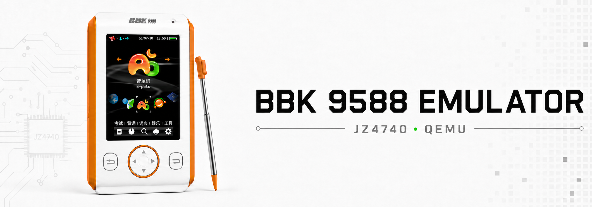

<p align="center">
  
</p>

# BBK 9588 Emulator

[](https://github.com/HelloClyde/bbk9588-emulator/actions/workflows/ci.yml)
[](https://github.com/HelloClyde/bbk9588-emulator/releases)
[](COPYING)

基于 QEMU 的步步高 BBK 9588 模拟器。项目实现 JZ4740/BBK 9588 设备模型，使用原始
NAND 启动 loader、U-Boot 和系统固件，并通过本地 Web 界面提供屏幕、触摸、按键、
音频状态和 NAND 文件管理。

> This project provides a QEMU hardware model and a local Web frontend for the
> BBK 9588 educational device.

## 快速开始

### Windows Release

1. 从 [Releases](https://github.com/HelloClyde/bbk9588-emulator/releases) 下载并解压
   `bbk9588-emulator-*.zip`。
2. 准备自己的 `bbk9588_nand.bin`，或从
   [BBK 9588 NAND v1.2.0 Release](https://github.com/HelloClyde/bbk9588-emulator/releases/tag/nand-v1.2.0)
   下载官方测试镜像。也可以[直接下载 `bbk9588_nand-v1.2.0.zip`](https://github.com/HelloClyde/bbk9588-emulator/releases/download/nand-v1.2.0/bbk9588_nand-v1.2.0.zip)，
   无需解压，放到模拟器解压目录即可。首次启动也可以直接在文件选择窗口中选择
   `.bin` 或 `.zip`。
3. 双击 `start-web.cmd`，浏览器会打开 <http://127.0.0.1:8000/>。

启动器会把 NAND 校验并导入到 `runtime/bbk9588_nand.bin`。以后直接双击启动即可。
也可以显式指定镜像：

```powershell
.\start-web.cmd -Nand D:\dumps\bbk9588_nand.bin
```

发布包已经包含编译好的 QEMU 和 Python runtime，不需要安装开发工具。

通过手机或其他局域网设备访问时，音频会随 Web 页面播放。iOS Safari 需要先触摸一次
模拟器屏幕、设备按键或声音按钮，以允许页面启动音频输出。Web 模式默认关闭服务器
主机的重复声卡输出；开发调试时可通过 `--qemu-host-audio` 同时开启本机声音。

## 当前能力

版本更新记录见 [CHANGELOG.md](CHANGELOG.md)。

- BootROM → NAND loader → U-Boot → C200 系统冷启动。
- JZ4740 INTC、TCU、CPM、DMAC、AIC/internal codec 等独立 QEMU 设备模型。
- LCD RGB565 frame chardev、本地 WebSocket 显示和左右 90° 旋转。
- GPIO/SADC 触摸、六个设备按键和自定义键盘映射。
- QEMU 主机与 Web PCM 音频输出、FPS、guest IPS、CPU、DMA/FIFO 状态。
- 唯一活动 raw NAND 的 data/OOB、page program、block erase 和原地持久写入。
- NAND 文件管理：目录、新建、导入、导出、改名和删除，可用于安装 BDA 应用。

## 数据与 NAND

标准 raw NAND 的数据容量为 512 MiB；加上每个 2 KiB page 的 64-byte OOB 后，镜像
文件为 528 MiB。NAND、固件、应用和商业资源不进入 Git 历史。用户可以导入自己合法
取得的 dump；维护者可以在确认拥有分发权后，把镜像作为独立 Release asset 发布。

当前公开镜像见 [BBK 9588 NAND v1.2.0](https://github.com/HelloClyde/bbk9588-emulator/releases/tag/nand-v1.2.0)。
模拟器程序包和 NAND 镜像采用独立版本线：模拟器使用 `v*`，NAND 镜像使用
`nand-v*`，两者需要分别下载。

`runtime/bbk9588_nand.bin` 是唯一活动 NAND。QEMU 直接原地写入该文件，不创建
checkpoint 或会话 work copy；测试必须自行提供临时 NAND fixture。再次运行
`start-web.cmd -Nand <镜像或ZIP>` 会显式替换活动 NAND，可用于恢复或更换镜像。

维护者可以用以下命令生成带 SHA256 manifest 的 NAND Release ZIP：

```powershell
python .\tools\package_nand_release.py D:\dumps\bbk9588_nand.bin --version v1
```

详细边界见 [DATA_NOTICE.md](DATA_NOTICE.md) 和 [镜像说明](docs/images.md)。

## 架构

```text
emu/                Python 运行层和 Web 前端
qemu/overlay/       应用到上游 QEMU 11.0.0 的设备模型源码
qemu/scripts/       Overlay 安装和 Windows 构建脚本
tools/              NAND 构建、runtime 收集和发布打包工具
tests/              单元、契约和集成测试
docs/               架构、开发说明和硬件模型计划
packaging/          下载包启动脚本与用户说明
```

默认运行路径坚持一个边界：QEMU 模拟 SoC、板级设备和 raw NAND，loader/U-Boot/C200
负责 FTL、FAT、资源和系统逻辑。Python 负责进程编排、Web 前端、离线镜像工具和诊断，
不通过固件 hook 替代硬件行为。

更多说明：

- [架构](docs/architecture.md)
- [开发规范](docs/development.md)
- [QEMU 构建](qemu/README.md)
- [JZ4740/BBK9588 改造计划](docs/jz4740-qemu-remodel-plan.md)

## 从源码开发

需要 Python 3.11+。QEMU Windows 构建还需要 MSYS2 UCRT64；完整依赖和命令见
[QEMU 构建说明](qemu/README.md)。

```powershell
git clone https://github.com/HelloClyde/bbk9588-emulator.git
cd bbk9588-emulator
python -m venv .venv
.\.venv\Scripts\Activate.ps1
python -m pip install -e ".[dev]"
python -m unittest tests.test_qemu_system
```

使用已经构建的 QEMU 启动开发前端：

```powershell
python -m emu.web.frontend `
  --boot-mode nand `
  --nand-image .\runtime\bbk9588_nand.bin `
  --qemu E:\qemu-src\build-bbk9588-win\qemu-system-mipsel.exe
```

## 发布

`.github/workflows/release.yml` 会下载固定版本的上游 QEMU、安装 overlay、编译
`mipsel-softmmu`、收集 Windows DLL、打包 Python runtime、运行结构校验并发布带
SHA256 的 ZIP。源码提交和标准 workflow 不包含 NAND。

## 项目状态

模拟器已经可以进入系统并运行多个内置应用和游戏，但仍在继续完善 FTL 掉电恢复、
NAND ECC/bad-block、LCD/SLCD、PM、USB 和剩余设备精度。已知边界以
[改造计划](docs/jz4740-qemu-remodel-plan.md)为准。

## 贡献与安全

提交代码前请阅读 [CONTRIBUTING.md](CONTRIBUTING.md)。安全问题请按
[SECURITY.md](SECURITY.md) 私下报告，不要在公开 issue 中附带固件或设备 dump。

## License

项目整体按 GNU GPL version 2 发布，见 [COPYING](COPYING)。从 QEMU 派生的文件保留
各自上游许可证和版权声明；部分 QEMU library 文件适用 [COPYING.LIB](COPYING.LIB)。
